# M5Stack CM4Stack 硬件检查命令

**用户名：`m5stack`，密码：`m5stack`，root密码：`m5stack`，主机名：`cm4stack`**

## 目录

- [Ethernet 网速测试](#title1)
- [USB 3.2 读写测试](#title2)
- [I2C 测试（PortA）](#title3)
- [触摸](#title4)
- [屏幕与喇叭](#title5)
- [RTC](#title6)
- [串口收发（PortB）](#title7)
- [I2C（ATECC608）](#title8)
- [*WSL 网口桥接*](#title9)

## <span id="title1">Ethernet 网速测试</span>

- 服务端设置

```shell
iperf -s -u
```

- 客户端设置

```sh
iperf -c server.ip -u
```

- 结果呈现

  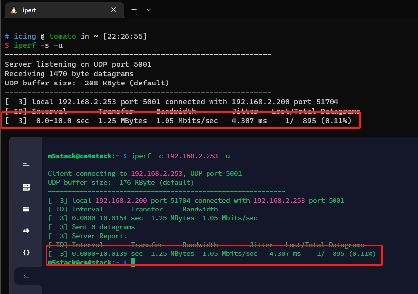

[*WSL环境点击此处*](#title9)

## <span id="title2">USB 3.2 读写测试</span>

- 挂载U盘（测试文件系统：**FAT32**）

  ```shell
  ls /dev/sd* #一般是sdb，而且格式化过会显示sdb1
  sudo mount /dev/sdb1 /mnt
  cd /mnt
  ```

- 测试写速度

  ```shell
  # dd 命令从输入文件(if=/dev/zero)读入空字符，然后以1M大小的块通过2048次总共2GB数据写入输出文件(/mnt/write_file)，FAT32文件系统最大单个文件4GB
  dd if=/dev/zero of=./write_file bs=1M count=2048
  ```

- 测试读速度

  ```shell
  #  如果我们做完写速度测试，就进行读速度测试就会得到一个快的起飞的假象，以为读速度超快可以达到113MB/s。这是因为刚进行完写操作，数据还存在缓存(cache) 里，因此读操作时直接从cache读而不是从硬盘里读取的，所以先清除缓存再进行读操作
  sudo sh -c "sync && echo 3 > /proc/sys/vm/drop_caches"
  dd if=./write_file of=/dev/null bs=4k
  ```

- 退出测试

  ```shell
  cd ~
  sudo umoount /mnt
  ```

- 结果呈现

  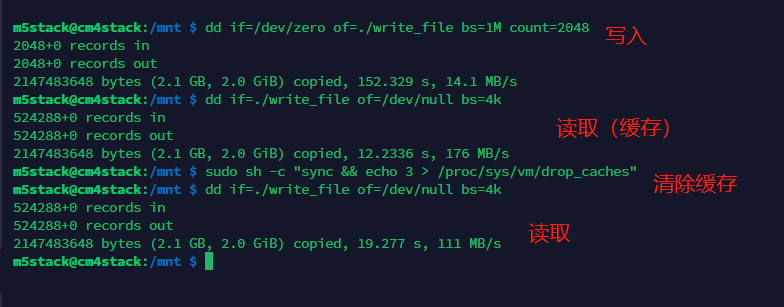

## <span id="title3"> I2C 测试（PortA）</span>

靠近 `USB-C` 口的 `Grove` 口是 `PortA`

测试硬件：**Unit 4-RELAY**

- 查看 I2C 设备

  ```shell
  i2cdetect -y 0 # PortA
  i2cdetect -y 1 # 内部 I2C 硬件
  # 其中 0x34 是 AW88298（功放），0x35 是 ATECC608（加密），0x51 是 BM8563（RTC），0x5d 是 GT911（触摸），
  ```

  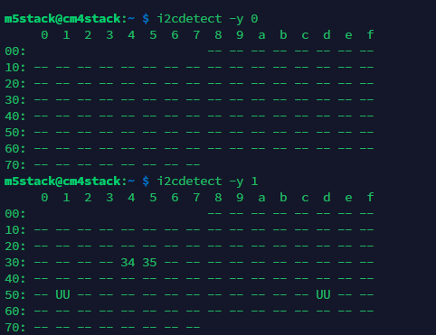

- 测试 PortA（插入**Unit 4-RELAY**）

  ```shell
  i2cdetect -y 0
  ```

  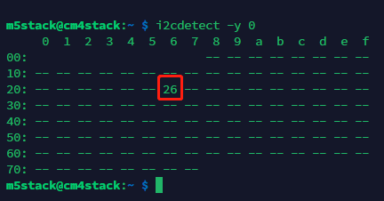

- 写入寄存器

  ```shell
  i2cset -y 0 0x26 0X11 0x01
  # Unit 4-RELAY 第一个继电器使能
  ```

  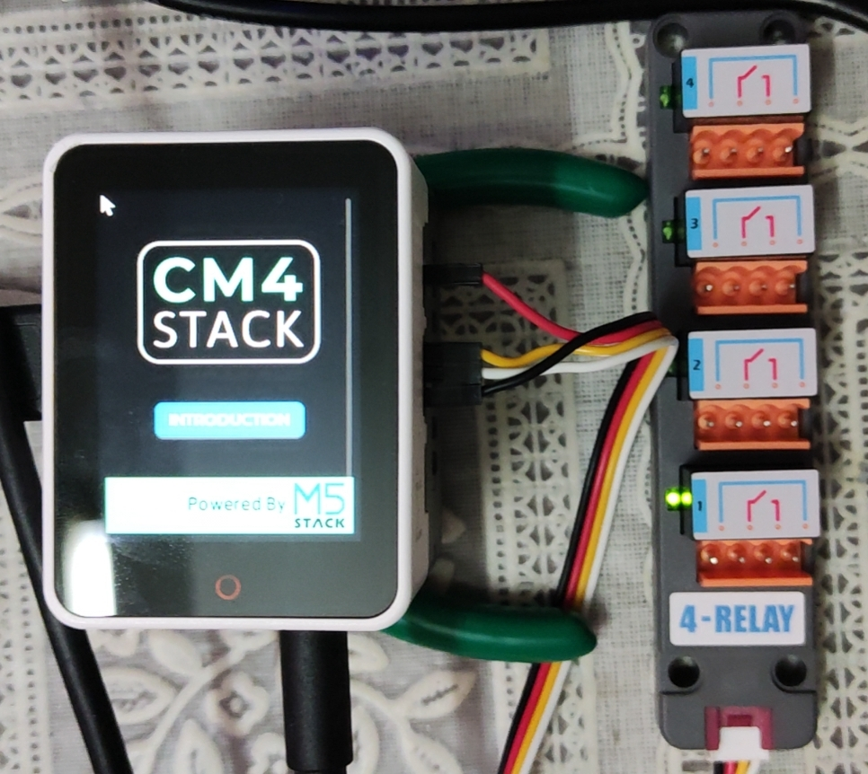

## <span id="title4">触摸</span>

- 查看 触摸 的文件设备

  ```shell
  sudo apt install evtest
  evtest
  ```

  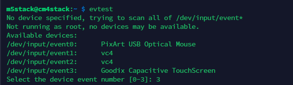

- 选择 **Goodix Capacitive TouchScreen**，当前为 `/dev/input/event3`，输入 `3` 回车

  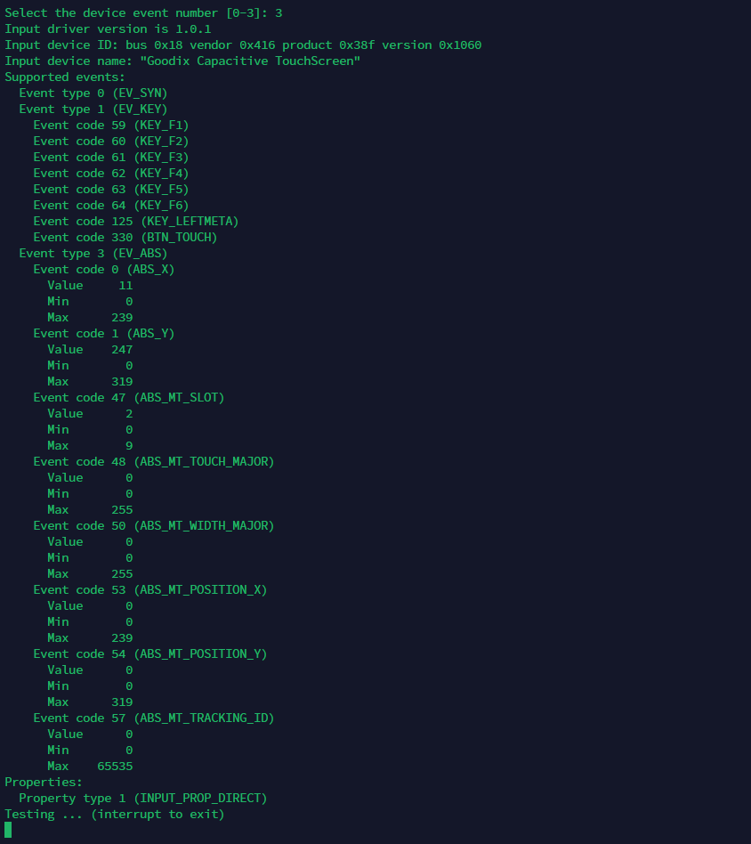

- 触摸屏幕

  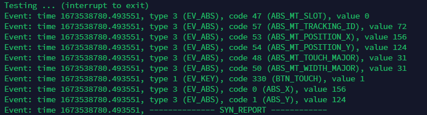

## <span id="title5">屏幕与喇叭</span>

- 查看 音频 播放设备

  ```shell
  aplay -l
  ```

  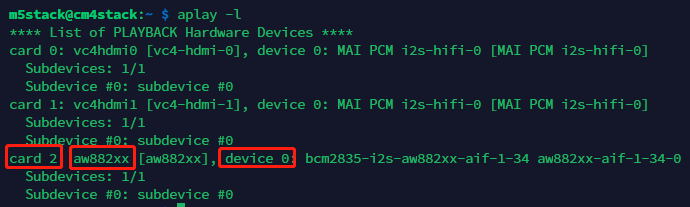

- 查看 FrameBuffer 设备

  ```shell
  ls /dev/fb*
  # 插上 HDMI 之后，小屏幕就变成 /dev/fb1
  ```

  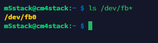

- 屏幕 喇叭 组合测试

  ```shell
  sudo ffmpeg -c:v h264 -i ./badapple.mp4 -vf "scale=w=320:h=240:force_original_aspect_ratio=2,crop=320:240,transpose=2" -pix_fmt rgb565le -f fbdev /dev/fb0 -af "volume=0.1" -acodec pcm_s32le -f alsa hw:2,0
  
  # volume 最大就是 1 ，不然就烧喇叭了
  ```

  有声有色就行，不放图了

## <span id="title6">RTC</span>

- 写入系统时间 并 查看硬件时钟时间

  ```shell
  date # 查看当前系统时间
  sudo hwclock -w # 将系统时间写入硬件时钟
  sudo hwclock -r # 查看硬件时钟时间
  ```

  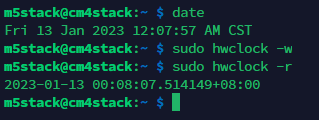

- Timer 计划重启功能

  ```shell
  sudo chmod 777 /sys/class/rtc/rtc0/wakealarm # 赋权
  cat /proc/driver/rtc # 查看时钟/IRQ设置
  echo "$(date -d 'now + 1 minutes' +%s)" > /sys/class/rtc/rtc0/wakealarm # 写入一个1分钟的计划
  cat /proc/driver/rtc # 看一下写进去没
  sudo poweroff # 关机等重启，一般一分多钟自己就起来了
  ```

  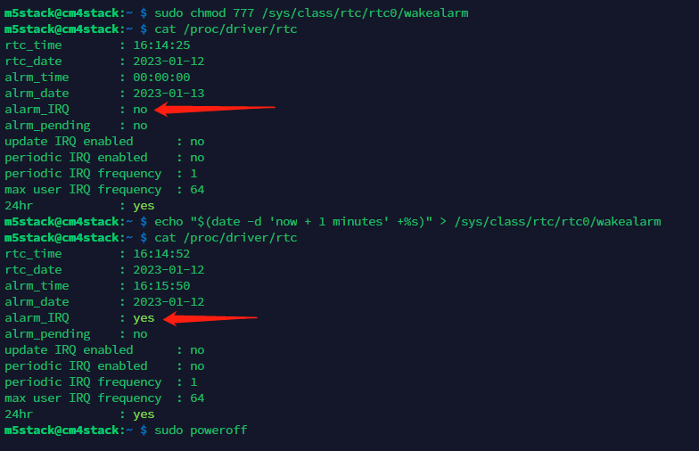

## <span id="title7">串口收发（PortB）</span>

靠近 `HDMI` 口的 `Grove` 口是 `PortB`

测试硬件：**小黄板等串口工具**

### PortB --> Serial Tool

- 安装 和 使用 `minocom`

  ```shell
  sudo chmod 777 /dev/ttyACM0 # 给小黄板赋权
  sudo apt-get install minicom # 下载安装 minicom
  sudo minicom -s # 打开 修改串口数据 保存默认 按 ESC 进入
  ```

  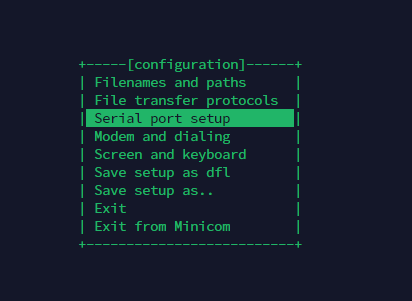

  

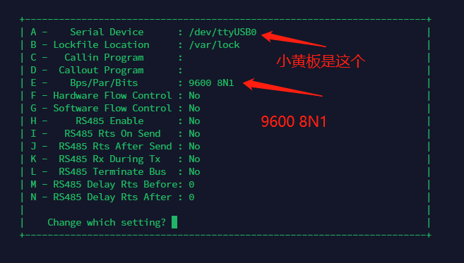

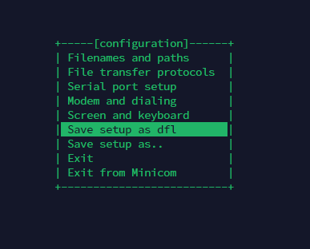

- 发送到 串口工具

  ```shell
  sudo chmod 777 /dev/ttyAMA1 # 赋权
  for ((;;)); do echo "Hello M5Stack!" > /dev/ttyAMA1; done # 回到串口工具发现被 Hello M5Stack! 霸屏
  
  # 在 minicom 界面先按 Ctrl+A ，再按 X 即可退出
  ```

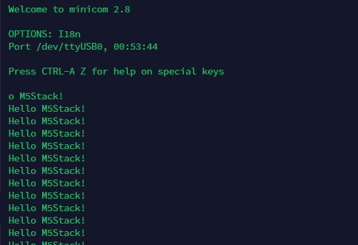

### Serial Tool --> PortB

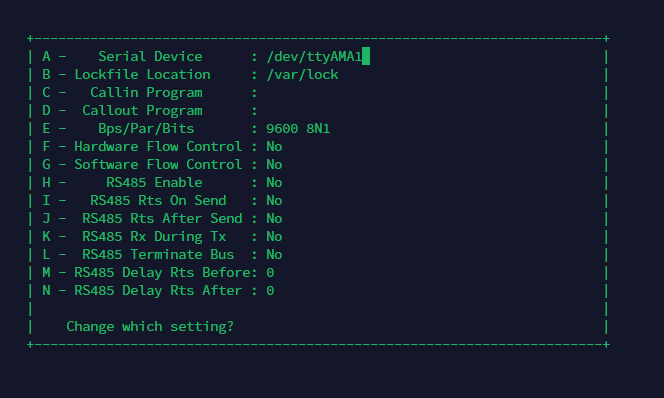

```shell
for ((;;)); do echo "Hello M5Stack!" > /dev/ttyUSB0; done # 回到串口工具发现又被 Hello M5Stack! 霸屏
```

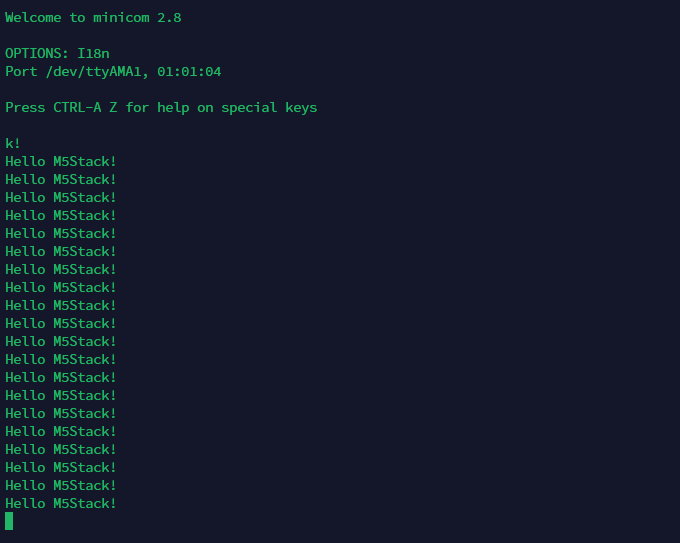

## <span id="title8">I2C（ATECC608）</span>

- 部署环境

  ```shell
  sudo apt install build-essential python3 python3-pip cmake libudev-dev libusb-1.0-0-dev libffi-dev libssl-dev git
  git clone https://github.com/MicrochipTech/cryptoauthtools.git
  cd cryptoauthtools/python/examples
  python3 -m pip install -r requirements.txt
  ```

- `0x35` 是 ATECC608，根据芯片手册，由于 cryptoauthlib（和设备）使用高 7 位来表示 i2c 地址，因此当左移一位时，上面的内容变为 `0x6a`

  ```shell
  python3 info.py -i i2c -p slave_address=0x6A
  ```

  

  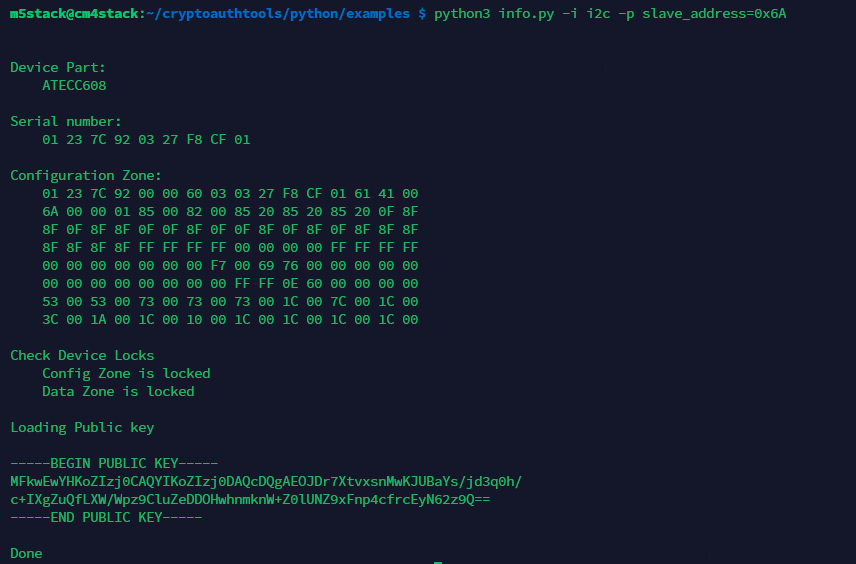 


## <span id="title9"><i>WSL 网口桥接</i></span>

将 WSL2 自建的 虚拟NAT 网络桥接到 Windows 主机网卡上

- ### 开启 Hyper-V

  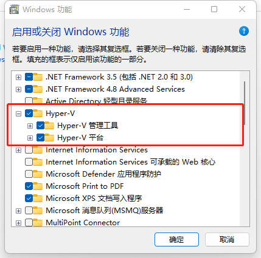

- ### 桥接网络  PowerShell  脚本

  - 设置桥接，命名为 `setWSLPass.ps1`

    ```powershell
    # 检查并以管理员身份运行PS并带上参数
    $currentWi = [Security.Principal.WindowsIdentity]::GetCurrent()
    $currentWp = [Security.Principal.WindowsPrincipal]$currentWi
    if( -not $currentWp.IsInRole([Security.Principal.WindowsBuiltInRole]::Administrator))
    {
        $boundPara = ($MyInvocation.BoundParameters.Keys | foreach{'-{0} {1}' -f  $_ ,$MyInvocation.BoundParameters[$_]} ) -join ' '
        $currentFile = $MyInvocation.MyCommand.Definition
        $fullPara = $boundPara + ' ' + $args -join ' '
        Start-Process "$psHome\pwsh.exe"   -ArgumentList "$currentFile $fullPara"   -verb runas
        return
    }
    #首先随意执行一条wsl指令，确保wsl启动，这样后续步骤才会出现WSL网络
    echo "check the wsl whether it is running..."
    wsl --cd ~ -e ls
    echo "get network card infomation..."
    Get-NetAdapter  # 获取网卡信息
    echo "Bridging WSL network to Ethernet..."
    # 注意这里，这里是把wsl的虚拟网卡 [WSL] 桥接到我们主机网卡 [以太网]，如果你想桥接到wifi网卡那应该做相应的调整
    # Set-VMSwitch WSL -NetAdapterName 以太网 
    Set-VMSwitch WSL -NetAdapterName "Wi-Fi 2"
    echo "`n Modifying WSL network configuration..."
    # 这里会去运行我们wsl中的一个网络配置脚本，记得改用户名！
    wsl --cd ~ -e sh -c /home/"用户名"/setWSLPass.sh
    echo "`ndone!!!"
    pause
    ```

  - 取消桥接，命名为 `unsetWSLPass.ps1`

    ```powershell
    # 检查并以管理员身份运行PS并带上参数
    $currentWi = [Security.Principal.WindowsIdentity]::GetCurrent()
    $currentWp = [Security.Principal.WindowsPrincipal]$currentWi
    if( -not $currentWp.IsInRole([Security.Principal.WindowsBuiltInRole]::Administrator))
    {
        $boundPara = ($MyInvocation.BoundParameters.Keys | foreach{'-{0} {1}' -f  $_ ,$MyInvocation.BoundParameters[$_]} ) -join ' '
        $currentFile = $MyInvocation.MyCommand.Definition
        $fullPara = $boundPara + ' ' + $args -join ' '
        Start-Process "$psHome\pwsh.exe"   -ArgumentList "$currentFile $fullPara"   -verb runas
        return
    }
    echo "Unbridge Network..."
    Set-VMSwitch WSL  -SwitchType Internal
    echo "reboot wsl..."
    wsl --shutdown
    wsl --cd ~ -e ls
    echo "`ndone"
    pause
    ```

  - 打开 WSL 环境，在用户家目录下新建一个 `setWSLPass.sh`

    ```sh
    #!/bin/bash
    # IP地址需要按需修改
    new_ip=192.168.2.253
    brd=192.168.2.255 
    # 网桥一般是.255
    gateway=192.168.2.1
    nameserver=192.168.2.1
    net_dev=eth0
    # 注意，下面这里需要用到wsl的sud执行命令，所以需要填写你wsl的密码
    echo "你的密码" | sudo -S ip addr del $(ip addr show $net_dev | grep 'inet\b' | awk '{print $2}' | head -n 1) dev $net_dev
    sudo ip addr add $new_ip/24 broadcast $brd dev $net_dev
    sudo ip route add 0.0.0.0/0 via $gateway dev $net_dev
    sudo sed -i "\$c nameserver $nameserver" /etc/resolv.conf
    ```

- 注意：默认情况下 Windows PowerShell不允许执行自定义脚本，所以需要修改设置打开执行权限。管理员方式打开PowerShell，执行 `Set-ExecutionPolicy Unrestricted` 或  `Set-ExecutionPolicy RemoteSigned` ，按 `Y` 确认即可

  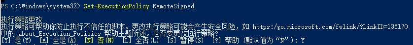

- 右键 以管理员身份运行 PowerShell， `cd` 到存放脚本的位置

  ```powershell
  .\setWSLPass.ps1
  ```

  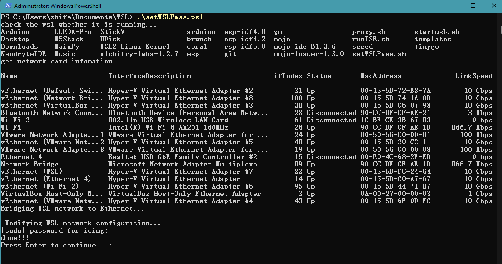